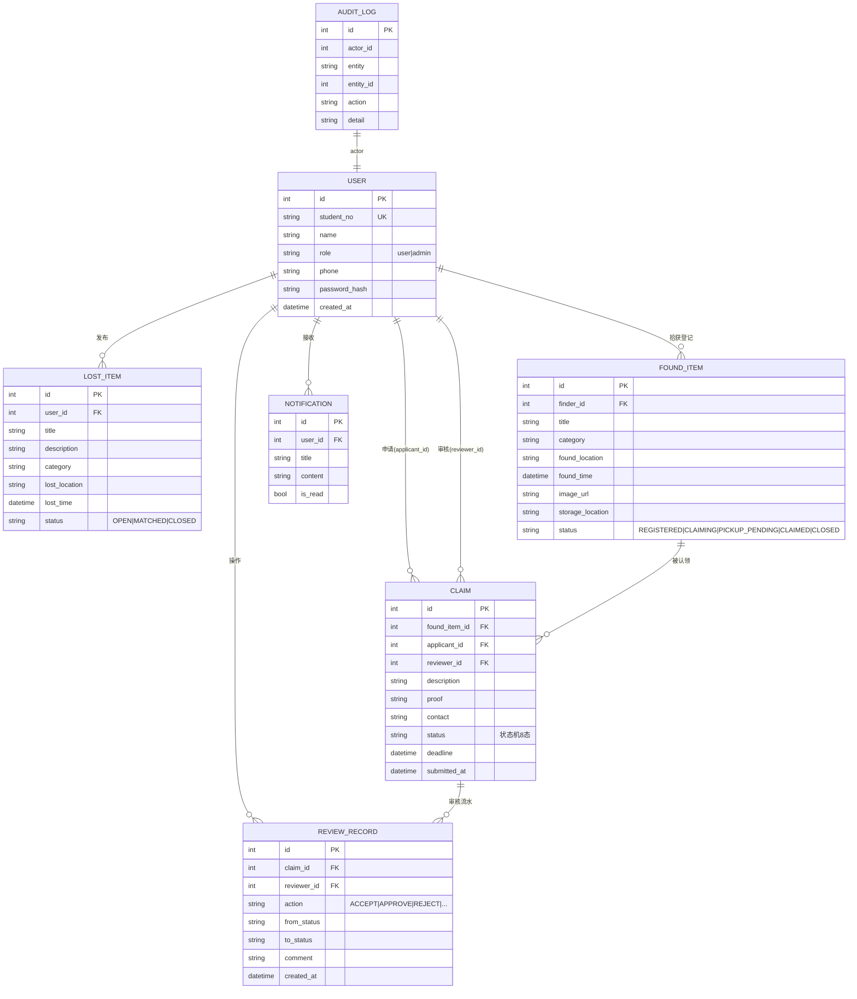

# 设计模型 01 — ER 图（实体关系）

> 直接复用 api-contract-v0.md §2 数据字典。基数：1 对多标注在连线上。

```mermaid
erDiagram
    USER ||--o{ LOST_ITEM : "发布"
    USER ||--o{ FOUND_ITEM : "拾获登记"
    USER ||--o{ CLAIM : "申请(applicant_id)"
    USER ||--o{ CLAIM : "审核(reviewer_id)"
    USER ||--o{ REVIEW_RECORD : "操作"
    USER ||--o{ NOTIFICATION : "接收"
    FOUND_ITEM ||--o{ CLAIM : "被认领"
    CLAIM ||--o{ REVIEW_RECORD : "审核流水"

    USER {
        int id PK
        string student_no UK
        string name
        string role "user|admin"
        string phone
        string password_hash
        datetime created_at
    }
    LOST_ITEM {
        int id PK
        int user_id FK
        string title
        string description
        string category
        string lost_location
        datetime lost_time
        string status "OPEN|MATCHED|CLOSED"
    }
    FOUND_ITEM {
        int id PK
        int finder_id FK
        string title
        string category
        string found_location
        datetime found_time
        string image_url
        string storage_location
        string status "REGISTERED|CLAIMING|PICKUP_PENDING|CLAIMED|CLOSED"
    }
    CLAIM {
        int id PK
        int found_item_id FK
        int applicant_id FK
        int reviewer_id FK
        string description
        string proof
        string contact
        string status "状态机8态"
        datetime deadline
        datetime submitted_at
    }
    REVIEW_RECORD {
        int id PK
        int claim_id FK
        int reviewer_id FK
        string action "ACCEPT|APPROVE|REJECT|..."
        string from_status
        string to_status
        string comment
        datetime created_at
    }
    NOTIFICATION {
        int id PK
        int user_id FK
        string title
        string content
        bool is_read
    }
    AUDIT_LOG {
        int id PK
        int actor_id
        string entity
        int entity_id
        string action
        string detail
    }
    AUDIT_LOG ||--|| USER : "actor"
```

要点：
- USER 与 CLAIM 存在两条关系（申请人 / 审核员），用两个外键区分。
- CLAIM↔REVIEW_RECORD 是"当前态 + 流水"组合：回放 REVIEW_RECORD 可重建任意 claim 的状态历史。
