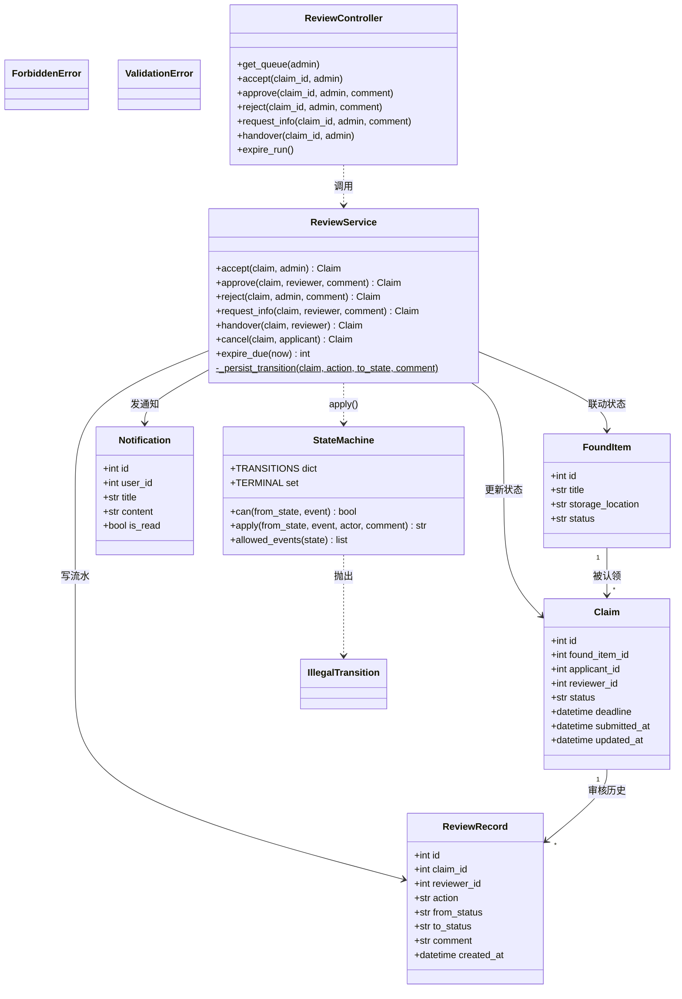

# 设计模型 06 — 类图（B 端审核模块实现结构）

```mermaid
classDiagram
    class Claim {
        +int id
        +int found_item_id
        +int applicant_id
        +int reviewer_id
        +str status
        +datetime deadline
        +datetime submitted_at
        +datetime updated_at
    }

    class ReviewRecord {
        +int id
        +int claim_id
        +int reviewer_id
        +str action
        +str from_status
        +str to_status
        +str comment
        +datetime created_at
    }

    class FoundItem {
        +int id
        +str title
        +str storage_location
        +str status
    }

    class Notification {
        +int id
        +int user_id
        +str title
        +str content
        +bool is_read
    }

    class StateMachine {
        +TRANSITIONS dict
        +TERMINAL set
        +can(from_state, event) bool
        +apply(from_state, event, actor, comment) str
        +allowed_events(state) list
    }

    class IllegalTransition
    class ForbiddenError
    class ValidationError

    class ReviewService {
        +accept(claim, admin) Claim
        +approve(claim, reviewer, comment) Claim
        +reject(claim, admin, comment) Claim
        +request_info(claim, reviewer, comment) Claim
        +handover(claim, reviewer) Claim
        +cancel(claim, applicant) Claim
        +expire_due(now) int
        -_persist_transition(claim, action, to_state, comment)$
    }

    class ReviewController {
        +get_queue(admin)
        +accept(claim_id, admin)
        +approve(claim_id, admin, comment)
        +reject(claim_id, admin, comment)
        +request_info(claim_id, admin, comment)
        +handover(claim_id, admin)
        +expire_run()
    }

    ReviewController ..> ReviewService : 调用
    ReviewService ..> StateMachine : apply()
    StateMachine ..> IllegalTransition : 抛出
    ReviewService --> Claim : 更新状态
    ReviewService --> ReviewRecord : 写流水
    ReviewService --> FoundItem : 联动状态
    ReviewService --> Notification : 发通知
    Claim "1" --> "*" ReviewRecord : 审核历史
    FoundItem "1" --> "*" Claim : 被认领
```

职责边界：
- `StateMachine`：纯函数式，不碰数据库，只回答"这条边存不存在、谁可触发"。
- `ReviewService`：事务边界，负责落库、联动物品状态、写流水、发通知、鉴权（reviewer 本人）。
- `ReviewController`：只做参数与角色校验，异常映射到统一错误码。
