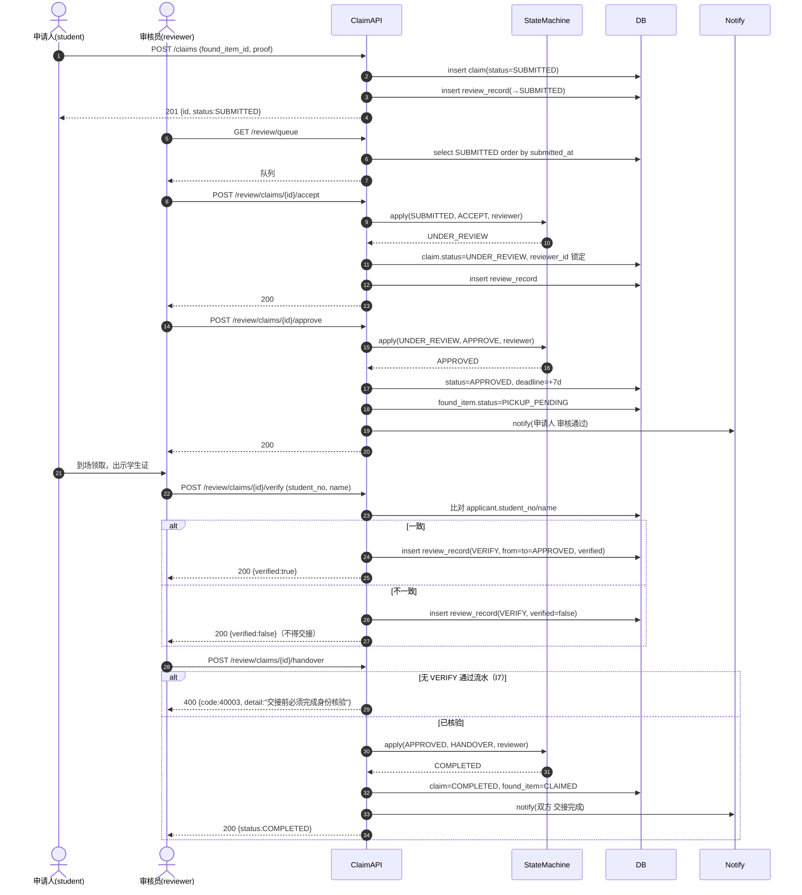
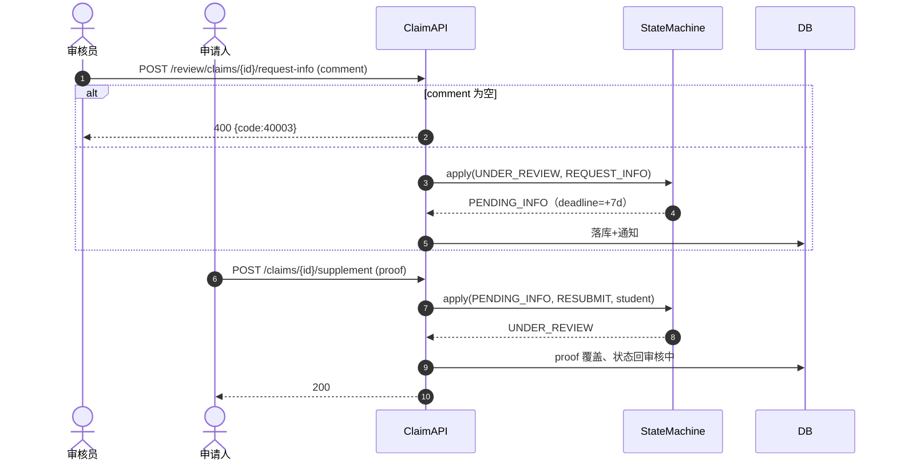
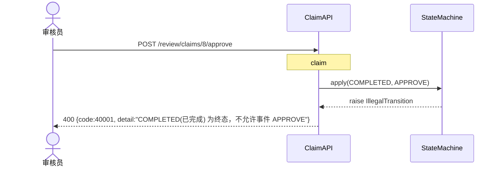

# 设计模型 04 — 时序图（审核主流程含身份核验 + 退回补充分支 + 非法迁移）

> v1：`admin`→`reviewer`；主流程在"通过"与"交接"之间加入身份核验（I7 前置）。

## 4.1 主流程：提交 → 接单 → 通过 → 核验 → 交接

```mermaid
sequenceDiagram
    autonumber
    actor U as 申请人(student)
    actor A as 审核员(reviewer)
    participant C as ClaimAPI
    participant S as StateMachine
    participant D as DB
    participant N as Notify

    U->>C: POST /claims (found_item_id, proof)
    C->>D: insert claim(status=SUBMITTED)
    C->>D: insert review_record(→SUBMITTED)
    C-->>U: 201 {id, status:SUBMITTED}

    A->>C: GET /review/queue
    C->>D: select SUBMITTED order by submitted_at
    C-->>A: 队列

    A->>C: POST /review/claims/{id}/accept
    C->>S: apply(SUBMITTED, ACCEPT, reviewer)
    S-->>C: UNDER_REVIEW
    C->>D: claim.status=UNDER_REVIEW, reviewer_id 锁定
    C->>D: insert review_record
    C-->>A: 200

    A->>C: POST /review/claims/{id}/approve
    C->>S: apply(UNDER_REVIEW, APPROVE, reviewer)
    S-->>C: APPROVED
    C->>D: status=APPROVED, deadline=+7d
    C->>D: found_item.status=PICKUP_PENDING
    C->>N: notify(申请人 审核通过)
    C-->>A: 200

    U->>A: 到场领取，出示学生证
    A->>C: POST /review/claims/{id}/verify (student_no, name)
    C->>D: 比对 applicant.student_no/name
    alt 一致
        C->>D: insert review_record(VERIFY, from=to=APPROVED, verified)
        C-->>A: 200 {verified:true}
    else 不一致
        C->>D: insert review_record(VERIFY, verified=false)
        C-->>A: 200 {verified:false}（不得交接）
    end

    A->>C: POST /review/claims/{id}/handover
    alt 无 VERIFY 通过流水（I7）
        C-->>A: 400 {code:40003, detail:"交接前必须完成身份核验"}
    else 已核验
        C->>S: apply(APPROVED, HANDOVER, reviewer)
        S-->>C: COMPLETED
        C->>D: claim=COMPLETED, found_item=CLAIMED
        C->>N: notify(双方 交接完成)
        C-->>A: 200 {status:COMPLETED}
    end
```

## 4.2 分支：退回补充 → 申请人补充 → 重新审核

```mermaid
sequenceDiagram
    autonumber
    actor A as 审核员
    actor U as 申请人
    participant C as ClaimAPI
    participant S as StateMachine
    participant D as DB

    A->>C: POST /review/claims/{id}/request-info (comment)
    alt comment 为空
        C-->>A: 400 {code:40003}
    else
        C->>S: apply(UNDER_REVIEW, REQUEST_INFO)
        S-->>C: PENDING_INFO（deadline=+7d）
        C->>D: 落库+通知
    end

    U->>C: POST /claims/{id}/supplement (proof)
    C->>S: apply(PENDING_INFO, RESUBMIT, student)
    S-->>C: UNDER_REVIEW
    C->>D: proof 覆盖、状态回审核中
    C-->>U: 200
```

## 4.3 异常：非法迁移（终态封闭）

```mermaid
sequenceDiagram
    actor A as 审核员
    participant C as ClaimAPI
    participant S as StateMachine

    A->>C: POST /review/claims/8/approve
    Note over C: claim#8 已 COMPLETED(终态)
    C->>S: apply(COMPLETED, APPROVE)
    S-->>C: raise IllegalTransition
    C-->>A: 400 {code:40001, detail:"COMPLETED(已完成) 为终态，不允许事件 APPROVE"}
```
